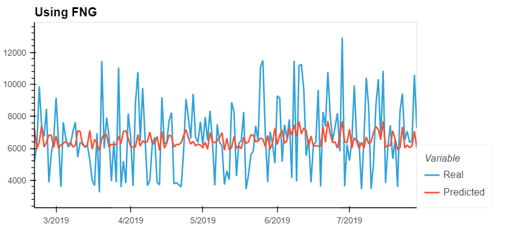

# Deeplearning-Homework

#### Background

Due to the volatility of cryptocurrency speculation, investors often try to incorporate sentiment from social media and news articles to help guide their trading strategies. One such indicator is the Crypto Fear and Greed Index (FNG) which attempts to use a variety of data sources to produce a daily FNG value for cryptocurrency. 

This assignment requires building and evaluation of deep learning models using both the FNG values and simple closing prices to determine if the FNG indicator provides a better signal for cryptocurrencies than the normal closing price data.

In this assignment, deep learning recurrent neural networks has been used to model bitcoin closing prices. One model will use the FNG indicators to predict the closing price while the second model will use a window of closing prices to predict the nth closing price.

#### Steps

- Prepare the data for training and testing
- Build and train custom LSTM RNNs
- Evaluate the performance of each model

#### Prepare the data for training and testing
- Converted provided csv file into DataFrame
- Created the window of time for the data in each dataset.
- For the Fear and Greed model, used the FNG values to predict the closing price
- For the closing price model, used previous closing prices to predict the closing price
- Used 70% of the data for training and 30% of the data for testing
- Applied a MinMaxScaler to the X and y values to scale the data for the model.
- Finally, reshaped the X_train and X_test values to fit the model's requirement of samples, time steps, and features

#### Build and train custom LSTM RNNs

Created same custom LSTM RNN architecture for both the models. In one used FNG value to fit the data and in other used only closing prices.
Used the same parameters and training steps for each model which is necessary to compare each model accurately.

#### Evaluate the performance of each model

Finally, used the testing data to evaluate each model and compare the performance.

**Q1:** Which model has a lower loss?

**A:** Model using closing price has lower loss compared to model with FNG 

###### Using Closing Price

| Sample|Window Size 10|
|:------------|-:|
|Training Loss|0.0331|   
|Test Loss    |0.0243|

###### FNG

| Sample| Window Size 10|
|:------------|-:|
|Training Loss|0.0566|  
|Test Loss    |0.0488|

**Q2:** Which model tracks the actual values better over time?

**A:** Model(window size 10) using closing price tracks ups and downs more closely over time compared to FNG model as shown in the charts below

 **Q3:** Which window size works best for the model?

**A:** Window size 9 works best for both the approaches due to least difference in loss rate between train and test sample which shows a better fit. 

###### Using Closing Price

| Sample/Window Size | 1 | 2 | 3 | 4 | 5 | 6 | 7 | 8 | 9 |10|
|:------------|:-:|:-:|:-:|:-:|:-:|:-:|:-:|:-:|:-:|-:|
|Training Loss|0.1451|0.1389|0.1199|0.0939|0.0955|0.0506|0.0480|0.0399|0.0250|0.0331|   
|Test Loss    |0.1299|0.1248|0.1087|0.0666|0.0734|0.0366|0.0305|0.0320|0.0174|0.0243|

###### FNG

| Sample/Window Size | 1 | 2 | 3 | 4 | 5 | 6 | 7 | 8 | 9 |10|
|:------------|:-:|:-:|:-:|:-:|:-:|:-:|:-:|:-:|:-:|-:|
|Training Loss|0.1448|0.1385|0.1202|0.0971|0.0922|0.0620|0.0616|0.0577|0.0541|0.0566|  
|Test Loss    |0.1296|0.1243|0.1091|0.0703|0.0701|0.0478|0.0446|0.0506|0.0484|0.0488|

